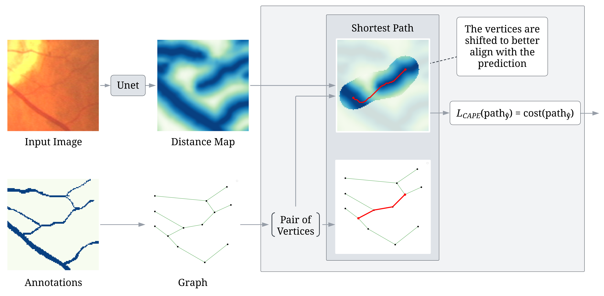

# CAPE: Connectivity-Aware Path Enforcement Loss for Curvilinear Structure Delineation

<p align="center">
  
</p>

CAPE addresses the challenge of preserving topological connectivity in curvilinear structure segmentation, a critical issue in biomedical imaging where conventional pixel-wise loss functions often fail to ensure global connectivity. By computing shortest paths in the pixel domain and comparing their costs, CAPE generates denser gradients along entire paths, enhancing connectivity enforcement while remaining suitable for gradient-based optimization. The implementation supports both 2D and 3D datasets and integrates seamlessly with deep learning frameworks like PyTorch.

After extracting the ground truth graph, an iterative process selects pairs of vertices and computes their shortest path. The corresponding path is then masked with dilation and projected to the pixel domain, and the shortest path algorithm is reapplied to obtain L<sub>CAPE</sub>.

### [Project Page](https://neuravisionlab.github.io/CAPE/) | [arXiv Paper](https://arxiv.org/abs/2504.00753) | [MICCAI Paper]()

## Usage

The loss requires several parameters for configuration which are described below:


- **`window_size (int):`** Size of the square patch (window) to process at a time.
- **`three_dimensional (bool):`** If True, operate in 3D mode; otherwise, operate in 2D.
- **`dilation_radius (int):`** Radius used to dilate ground-truth paths for masking.
- **`shifting_radius (int):`** Radius for refining start/end points to lowest-cost nearby pixels.
- **`is_binary (bool):`** If True, treat inputs as binary maps (invert predictions/ground truth).
- **`distance_threshold (float):`** Maximum value used for clipping ground-truth distance maps.
- **`single_edge (bool):`** If True, sample a single edge at a time; otherwise, sample a path.

> **Notes:** <br>
> Predictions must be a `torch.Tensor` of shape `(batch, H, W)` for 2D or `(batch, D, H, W)` for 3D. <br>
> Ground truths can be a list of graphs in `networkx.Graph` format, or images (`np.ndarray` or `torch.Tensor`) of the same shape as prediction.


## Installation

To use this code, you need to have the following dependencies installed.

```bash
# Clone the repository
git clone https://github.com/neuravisionlab/CAPE.git

# Install dependencies
pip install torch numpy scikit-image opencv-python scipy networkx
```


## Graph Extraction & Export

The **`utils`** folder includes our implementation of two key functions—`graph_from_skeleton_2D`
and `graph_from_skeleton_3D`—used by CAPE. Each function converts an skeleton mask into an undirected `networkx.Graph`. We also include helper functions for cropping these graphs into smaller patches under the same directory. 

For large datasets it is faster to build the graphs once and cache them than to regenerate them at every training step. The script `extract_graph.py` automates this: it calls `graph_from_skeleton_2D` / `graph_from_skeleton_3D` on every binary `.npy` mask, converts the mask to a `networkx.Graph`, and stores the result as a `.gpickle` file.

```bash
# 2-D dataset → graphs (saved to npy_images/data_as_graph)
python extract_graph.py npy_images

# 3-D dataset → graphs (saved to ./brain_graphs)
python extract_graph.py brain_vols --dim 3 --out_dir brain_graphs
```
Useful flags
	•	--dim {2|3} choose 2-D or 3-D builder (default 2)
	•	--threshold T binarise masks that are not already 0/1 (default 0.5)
	•	--out_dir DIR folder for the resulting .gpickle graphs (default data_as_graph)

```python
from extract_graph import read_gpickle

gpickle_path = "data_as_graph/example_graph.gpickle"
G = read_gpickle(gpickle_path)
```
These cached graphs can be passed directly to the CAPE loss as ground-truth, avoiding graph construction inside the training loop.

## Datasets

The CAPE loss has been evaluated on the following datasets:

- [CREMI](https://cremi.org/data/)
- [DRIVE](https://drive.grand-challenge.org)
- Brain

## Citing

If you find our work useful, please consider citing:

```BibTeX
@misc{esmaeilzadeh2025,
      title={CAPE: Connectivity-Aware Path Enforcement Loss for Curvilinear Structure Delineation}, 
      author={Elyar Esmaeilzadeh and Ehsan Garaaghaji and Farzad Hallaji Azad and Doruk Oner},
      year={2025},
      eprint={2504.00753},
      archivePrefix={arXiv},
      primaryClass={cs.CV},
      url={https://arxiv.org/abs/2504.00753}, 
}
```
