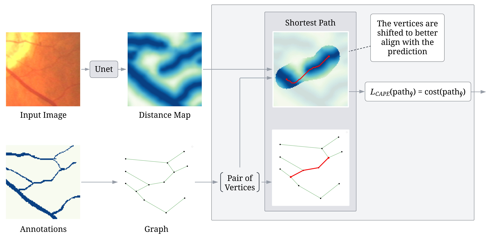

# CAPE: Connectivity-Aware Path Enforcement Loss for Curvilinear Structure Delineation

<p align="center">
  
</p>

CAPE addresses the challenge of preserving topological connectivity in curvilinear structure segmentation, a critical issue in biomedical imaging where conventional pixel-wise loss functions often fail to ensure global connectivity. By computing shortest paths in the pixel domain and comparing their costs, CAPE generates denser gradients along entire paths, enhancing connectivity enforcement while remaining suitable for gradient-based optimization. The implementation supports both 2D and 3D datasets and integrates seamlessly with deep learning frameworks like PyTorch.

After extracting the ground truth graph, an iterative process selects pairs of vertices and computes their shortest path. The corresponding path is then masked with dilation and projected to the pixel domain, and the shortest path algorithm is reapplied to obtain L<sub>CAPE</sub>.

### [Project Page](https://neuravisionlab.github.io/CAPE/) | [arXiv Paper](https://arxiv.org/abs/2504.00753) | [MICCAI Paper]()

## Usage

The loss requires several parameters for configuration which are described below:


- **`window_size (int):`** Size of the square patch (window) to process at a time.
- **`three_dimensional (bool):`** If True, operate in 3D mode; otherwise, operate in 2D.
- **`dilation_radius (int):`** Radius used to dilate ground-truth paths for masking.
- **`shifting_radius (int):`** Radius for refining start/end points to lowest-cost nearby pixels.
- **`is_binary (bool):`** If True, treat inputs as binary maps (invert predictions/ground truth).
- **`distance_threshold (float):`** Maximum value used for clipping ground-truth distance maps.
- **`single_edge (bool):`** If True, sample a single edge at a time; otherwise, sample a path.

> **Notes:** <br>
> Predictions must be a `torch.Tensor` of shape `(batch, H, W)` for 2D or `(batch, D, H, W)` for 3D. <br>
> Ground truths can be a list of graphs in `networkx.Graph` format, or images (`np.ndarray` or `torch.Tensor`) of the same shape as prediction.


## Installation

To use this code, you need to have the following dependencies installed.

```bash
# Clone the repository
git clone https://github.com/neuravisionlab/CAPE.git
cd CAPE

# Core (loss only)
pip install torch numpy scikit-image opencv-python scipy networkx

# Full training (CREMI 2D)
pip install PyYAML shapely scikit-learn tensorboard
```


## CREMI 2D training

A full training pipeline for the CREMI dataset in 2D (MSE + CAPE loss) is included.

### Data

Place your data under `<root_dir>/<dataset_name>/` and set `root_dir` and `dataset_name` in `config/cremi_2d.yaml`.

- **`images/`** — `<id>_image.npy`, shape (H, W) or (1, H, W).
- **`distances/`** — `<id>_distance.npy`, distance transform (zero on the structure).
- **`graphs/`** (optional) — `<id>.gpickle`, pre-extracted graphs (e.g. from `extract_graph.py`). Used when `use_graphs: true`; otherwise CAPE uses the distance map and skeletonizes at training time.

### Run

From the repository root:

```bash
python train_cremi.py --config_file config/cremi_2d.yaml
```

- `--resume last|best_loss|no` — which checkpoint to resume from.
- `--fold 0 1 2` — which folds to train (default: all).
- `--tensorboard` — log to TensorBoard (default: true).

Checkpoints and logs go to `output_path` (see config), with one subfolder per fold.

## Graph extraction

The **`utils`** folder provides `graph_from_skeleton_2D` and `graph_from_skeleton_3D`, which turn a skeleton mask into an undirected `networkx.Graph`. Helper functions for cropping graphs into patches are in the same folder.

**Script `extract_graph.py`** builds graphs from binary `.npy` masks and saves them as **.gpickle** files:

```bash
# 2-D: read *.npy from folder, write .gpickle to data_as_graph
python extract_graph.py npy_images

# 3-D
python extract_graph.py brain_vols --dim 3 --out_dir brain_graphs
```

Options: `--dim {2|3}`, `--threshold T`, `--out_dir DIR`.

**CREMI 2D training** reads the same **.gpickle** format. Put each graph in `graphs/<id>.gpickle` where `<id>` matches the image (e.g. `images/<id>_image.npy` → `graphs/<id>.gpickle`). Use the same `<id>` as in your image filenames when running `extract_graph.py` (e.g. masks named `<id>.npy` produce `<id>.gpickle`).

## Datasets

The CAPE loss has been evaluated on the following datasets:

- [CREMI](https://cremi.org/data/)
- [DRIVE](https://drive.grand-challenge.org)
- Brain

## Citing

If you find our work useful, please consider citing:

```BibTeX
@misc{esmaeilzadeh2025,
      title={CAPE: Connectivity-Aware Path Enforcement Loss for Curvilinear Structure Delineation}, 
      author={Elyar Esmaeilzadeh and Ehsan Garaaghaji and Farzad Hallaji Azad and Doruk Oner},
      year={2025},
      eprint={2504.00753},
      archivePrefix={arXiv},
      primaryClass={cs.CV},
      url={https://arxiv.org/abs/2504.00753}, 
}
```
